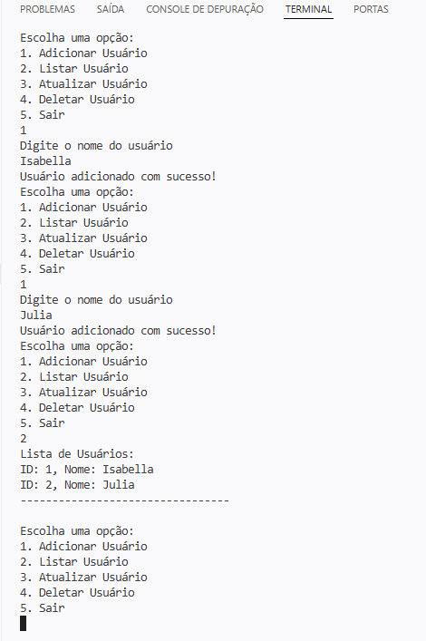

<div align="center">

# C# MVC User CRUD

### Console Application for Practicing Backend Fundamentals

A console-based user management application built with C# and .NET, focused on CRUD operations and the MVC architectural pattern.

</div>

<div align="center">


</div>

---

## Project Snapshot

<table>
  <tr>
    <td><strong>Project Type</strong></td>
    <td>Console application</td>
  </tr>
  <tr>
    <td><strong>Main Goal</strong></td>
    <td>Practice CRUD operations using C# and the MVC architectural pattern</td>
  </tr>
  <tr>
    <td><strong>Architecture</strong></td>
    <td>MVC - Model, View, Controller</td>
  </tr>
  <tr>
    <td><strong>Language</strong></td>
    <td>C#</td>
  </tr>
  <tr>
    <td><strong>Platform</strong></td>
    <td>.NET</td>
  </tr>
  <tr>
    <td><strong>Data Storage</strong></td>
    <td>In-memory data manipulation</td>
  </tr>
</table>

---

## Navigation

<table>
  <tr>
    <td><a href="#overview"><strong>Overview</strong></a><br>What the project is about.</td>
    <td><a href="#why-this-project-matters"><strong>Why It Matters</strong></a><br>The fundamentals practiced in this project.</td>
  </tr>
  <tr>
    <td><a href="#features"><strong>Features</strong></a><br>Main CRUD operations implemented.</td>
    <td><a href="#mvc-architecture"><strong>MVC Architecture</strong></a><br>How responsibilities were separated.</td>
  </tr>
  <tr>
    <td><a href="#demo"><strong>Demo</strong></a><br>Console application running.</td>
    <td><a href="#technology-stack"><strong>Technology Stack</strong></a><br>Technologies used in the project.</td>
  </tr>
  <tr>
    <td><a href="#project-structure"><strong>Project Structure</strong></a><br>Suggested organization of the application.</td>
    <td><a href="#key-learnings"><strong>Key Learnings</strong></a><br>Concepts practiced during development.</td>
  </tr>
  <tr>
    <td><a href="#future-improvements"><strong>Future Improvements</strong></a><br>Possible next steps for the project.</td>
    <td><a href="#final-note"><strong>Final Note</strong></a><br>Main takeaway from this study project.</td>
  </tr>
</table>

---

<a id="overview"></a>

## Overview

This project is a console-based user management application developed in C#.

The application simulates a simple CRUD system where users can be created, listed, updated and removed through terminal interaction.

The main focus was to practice backend fundamentals while keeping the code organized using the MVC architectural pattern.

---

<a id="why-this-project-matters"></a>

## Why This Project Matters

CRUD operations are one of the most common foundations of backend development.

Even in a simple console application, this project helps practice important concepts such as:

- Data creation;
- Data reading;
- Data updating;
- Data deletion;
- Control flow;
- Separation of responsibilities;
- Basic application architecture.

> [!NOTE]
> This is a study project focused on consolidating backend fundamentals with C# and .NET.

---

<a id="features"></a>

## Features

The application includes the basic operations of a user management system:

| Feature | Description |
|---|---|
| Create User | Registers a new user |
| List Users | Displays all registered users |
| Update User | Updates existing user information |
| Delete User | Removes a user from the system |

---

<a id="mvc-architecture"></a>

## MVC Architecture

The project follows the MVC pattern to keep responsibilities separated.

| Layer | Responsibility |
|---|---|
| Model | Defines the user data structure |
| View | Handles console interaction with the user |
| Controller | Manages application flow and business logic |

This separation makes the code easier to understand, maintain and evolve.

A simplified representation:

```text
User input
    |
    v
View
    |
    v
Controller
    |
    v
Model
```

---

<a id="demo"></a>

## Demo

The screenshot below shows the application running in the console.



---

<a id="technology-stack"></a>

## Technology Stack

| Technology | Purpose |
|---|---|
| C# | Main programming language |
| .NET | Application platform |
| MVC | Architectural pattern |
| Console | User interaction interface |
| In-memory storage | Temporary data manipulation during execution |

---

<a id="project-structure"></a>

## Project Structure

A possible project structure is:

```text
csharp-mvc-user-crud/
|-- Controllers/
|   |-- UserController.cs
|-- Models/
|   |-- User.cs
|-- Views/
|   |-- UserView.cs
|-- Program.cs
|-- README.md
|-- assets/
|   |-- teste.png
```

---

<a id="key-learnings"></a>

## Key Learnings

During this project, I practiced:

- Structuring a C# project;
- Creating a simple CRUD flow;
- Applying the MVC architectural pattern;
- Separating responsibilities between layers;
- Working with console input and output;
- Manipulating data in memory;
- Organizing backend logic;
- Improving code readability and maintainability.

---

<a id="future-improvements"></a>

## Future Improvements

Possible improvements for this project include:

- Add data persistence using files or a database;
- Add input validation;
- Add error handling;
- Add search by user ID or name;
- Improve menu navigation;
- Add unit tests;
- Create a version using ASP.NET MVC;
- Connect the application to a relational database.

---

<a id="final-note"></a>

## Final Note

This project was developed for study purposes.

The main goal was not to build a complex system, but to practice core backend concepts in a clear and organized way.

Understanding CRUD and MVC in a simple console application creates a strong foundation for building larger applications later.

---

## License

This project was developed for learning purposes.
